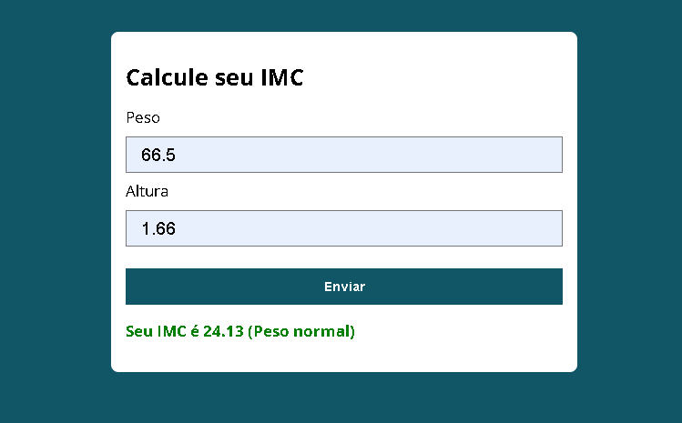

# 📊 Calculadora de IMC

Uma aplicação simples desenvolvida com **JavaScript puro**, **HTML** e **CSS** que calcula o IMC (Índice de Massa Corporal) de uma pessoa com base no peso e altura fornecidos.

## 🚀 Funcionalidades

- Captura e valida os dados do formulário (peso e altura);
- Calcula o IMC corretamente;
- Retorna uma mensagem indicando a classificação do IMC:
  - Abaixo do peso
  - Peso normal
  - Sobrepeso
  - Obesidade grau 1, 2 ou 3
- Exibe mensagens de erro para valores inválidos

## 💻 Tecnologias Utilizadas

- HTML5
- CSS3
- JavaScript (ES6)

## 🧠 Lógica de Cálculo

A fórmula utilizada para o cálculo do IMC é:
IMC = peso / (altura * altura)

A classificação é baseada nos seguintes critérios:

| IMC           | Classificação       |
|---------------|---------------------|
| Menor que 18.5 | Abaixo do peso      |
| 18.5 a 24.9    | Peso normal         |
| 25 a 29.9      | Sobrepeso           |
| 30 a 34.9      | Obesidade grau 1    |
| 35 a 39.9      | Obesidade grau 2    |
| Acima de 40    | Obesidade grau 3    |

## 📸 Preview

  

